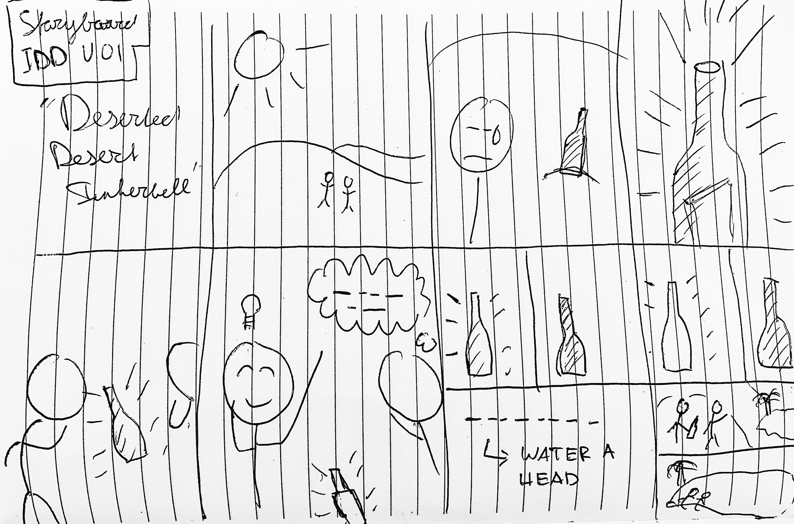
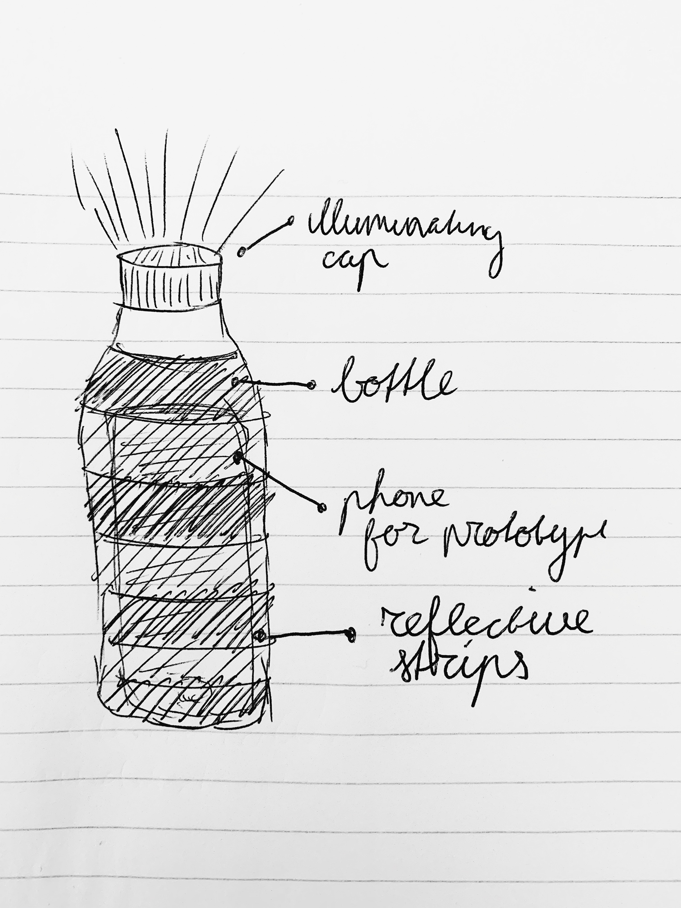
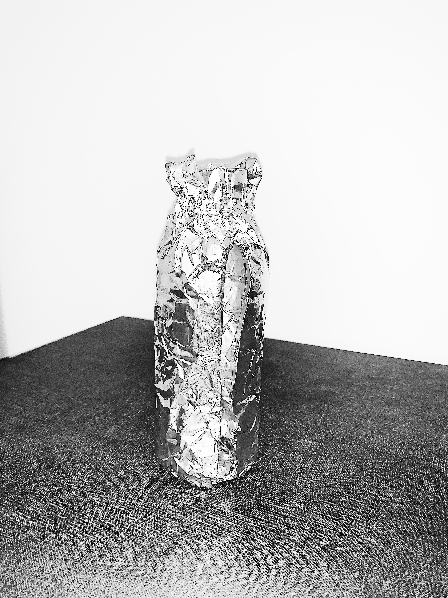

# Staging Interaction

In the original stage production of Peter Pan, Tinker Bell was represented by a darting light created by a small handheld mirror off-stage, reflecting a little circle of light from a powerful lamp. Tinkerbell communicates her presence through this light to the other characters. See more info [here](https://en.wikipedia.org/wiki/Tinker_Bell).

## Report

A brief overview of all deliverables and necessary information.
## Deliverables

1. [x] Storyboard
2. [x] Sketches/photos of costumed device
3. [] Any reflections you have on the process
4. [] Video sketch of the prototyped interaction
5. [] Submit the items above in the lab1 folder of your class [Github page]

## Prep

- [x] Setup Github and own "Lab Hub"
- [x] Setup README.md
- [x] Learn GIT
- [x] Get tools (paper, scissors, smartphone, computer, materials)

### The Report

This README.md page in your own repository should be edited to include the work you have done (the deliverables mentioned above). Following the format below, you can delete everything but the headers and the sections between the **stars**. Write the answers to the questions under the starred sentences. Include any material that explains what you did in this lab hub folder, and link it in your README.md for the lab.

## Lab Overview

For this assignment, you are going to:

A) [Plan](#part-a-plan)

B) [Act out the interaction](#part-b-act-out-the-interaction)

C) [Prototype the device](#part-c-prototype-the-device)

D) [Wizard the device](#part-d-wizard-the-device)

E) [Costume the device](#part-e-costume-the-device)

F) [Record the interaction](#part-f-record)

Labs are due on Mondays. Make sure this page is linked to on your main class hub page.

## Part A. Plan

\*\***Describe your setting, players, activity and goals here.**\*\*

_Setting:_ The deserted desert during the night where the Tinkerbelle device, disguisted as a bottle, communicates through Morse code for "Water"

_Players:_ Two lonely travelers, seeking for water and the bottle hidden in the sand

_Activity:_ The two travelers find a bright shining light among the burning heat of the sun. They decide if this is a Fata Morgana (Mirage) or actually true. One of the comrads finds out this is Tinkerbelle signalling for "Water"

_Goals:_ When the travellers find the bottle, they are not sure if it is real. So the Tinkerbelle device switches from the Morse sequence of "Water" to a more humane signal to indicates it understands the two travellers. Later it switch backs.

### Storyboard

\*\***Include a picture of your storyboard here**\*\*

\*\***Summarize feedback you got here.**\*\*

### Feedback 

* Think about chiming to make device human enough to catch attention
* Present desert in the dark instead of during the day, visibility of item
* How to point to the right direction? Utilize tilt sensor f.e

## Part B. Act out the Interaction

\*\***Are there things that seemed better on paper than acted out?**\*\*

1. The location: desert is not really feasible to reach for prototyping
2. The time of day: with the sun out the light effect is less impressive

\*\***Are there new ideas that occur to you or your collaborators that come up from the acting?**\*\*

1. There should be more humanized interation (voice - sound - haptics)
## Part C. Prototype the device

Code for the "Tinkerbelle" tool, and instructions for setting up the server and your phone are [here](https://github.com/FAR-Lab/tinkerbelle).

\*\***Give us feedback on Tinkerbelle.**\*\*

1. Fullscreen only works on desktop
2. Light patterns are tricky to implement
3. Great sync!

## Part D. Wizard the device

Take a little time to set up the wizarding set-up that allows for someone to remotely control the device while someone acts with it. Hint: You can use Zoom to record videos, and you can pin someone’s video feed if that is the scene which you want to record.

## Part E. Costume the device

\*\***Include sketches of what your device might look like here.**\*\*

\*\***What concerns or opportunitities are influencing the way you've designed the device to look?**\*\*

1. Aluminium foil conducts touch, putting phone inside case creates interaction with the screen
2. No use case visible through video
## Part F. Record

\*\***Take a video of your prototyped interaction.**\*\*

_Devices chimes user when close to water_
## Reflection

Heavy work in process, lacked creativity in the process towards the deliverable. Need to do better next time on quality of assets, documentation, collaboration and general inspiration. 
# Staging Interaction, Part 2

This describes the second week's work for this lab activity.

## Prep (to be done before Lab on Wednesday)

You will be assigned three partners from another group. Go to their github pages, view their videos, and provide them with reactions, suggestions & feedback: explain to them what you saw happening in their video. Guess the scene and the goals of the character. Ask them about anything that wasn’t clear.

\*\***Summarize feedback from your partners here.**\*\*

## Make it your own

Do last week’s assignment again, but this time:

1. It doesn’t have to (just) use light,
2. You can use any modality (e.g., vibration, sound) to prototype the behaviors! Again, be creative!
3. We will be grading with an emphasis on creativity.

\*\***Document everything here. (Particularly, we would like to see the storyboard and video, although photos of the prototype are also great.)**\*\*
